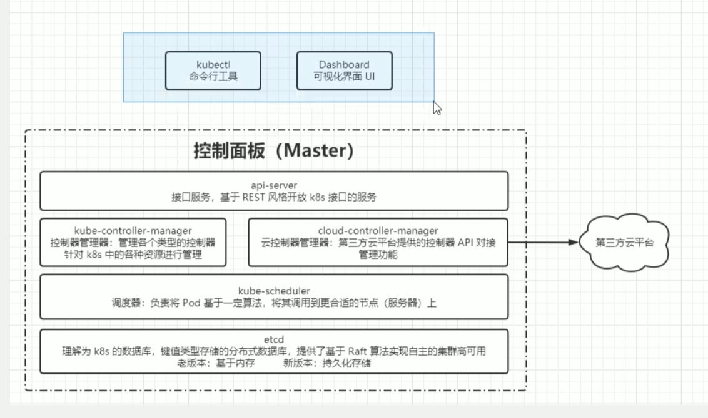
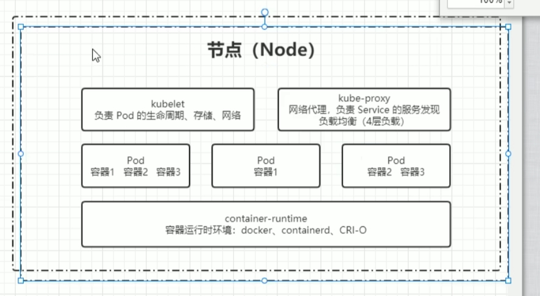
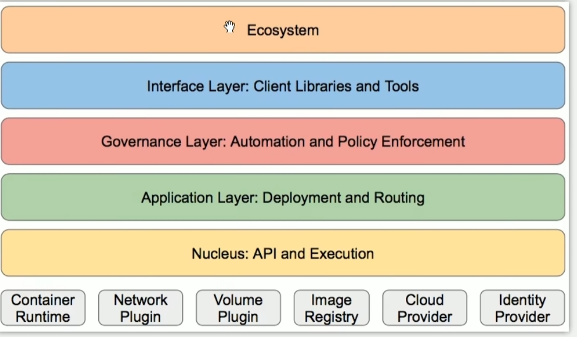

# Master

master节点上包含组件如下图所示：

通过Api-Server 调度服务

# Node

node的节点中包含一个以及多个pod，pod包含一个以及多个容器

# 附加组件

1. kube-dns
2. ingress Controller
3. Prometheus
4. Dashboard
5. Federation
6. Fluentd-elasticsearch 日志存储

# 分层架构

1. 生态系统
2. 接口层
3. 管理层
4. 应用层
5. 核心层 k8s 最核心的功能，对外提供API构建高层的应用，对内提供插件式应用服务

