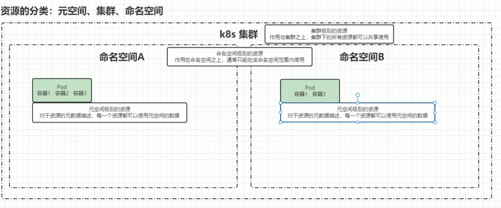
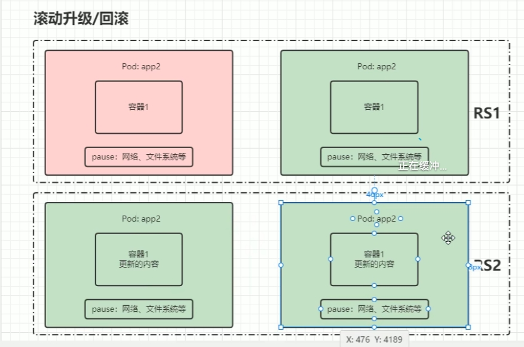
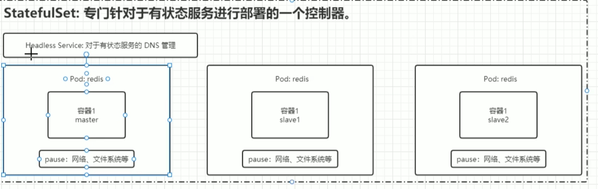
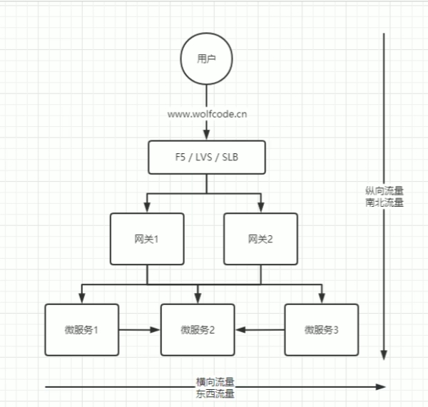
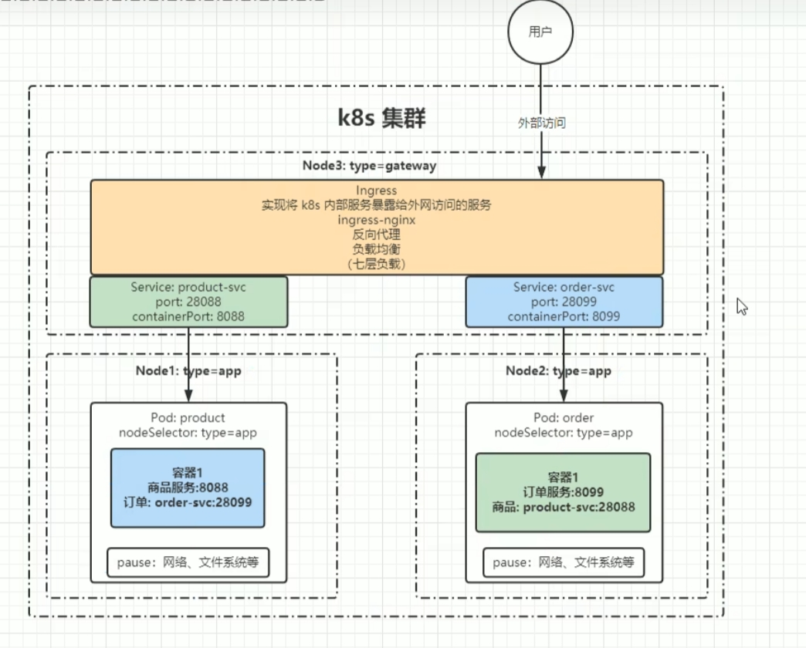

# 资源的分类

## 元数据

1. HPA（Horizontal Pod AutoScaler）
    动态扩容、缩容
2. PodTemplate
    Pod模板
3. LimitRange    集群资源限制
   1. limit 限制
   2. range  

## 集群级

1. Namespace
2. Node
3. ClusterRole
4. ClusterRoleBinding 可以绑定到集群上

## 命名空间级

### 工作负载型 Pod

1. 控制器
   1. 适用无状态服务
      1. ReplicationController（RC）1.12.x之后废除
      2. ReplicaSet（RS）动态更新Pod的副本数，可以通过Selector来选择对哪些Pod生效，较少使用
         1. Label
         2. Selector
        
        将RS1 复制一份，然后创建pod，可用之后，停止pod1，RS2再复制pod，停止RS1，但保留RS1保留回滚。

      3. Deployment 针对RS更高层次的封装，提供了更丰富的部署相关的功能。
         1. 创建RS/pod
         2. 滚动升级、回滚
         3. 平滑扩容和缩容，基于RS
         4. 暂停与恢复 Deployment
   
   2. 适用有状态服务
      1. StatefulSet
         1. 主要特点：
            1. 稳定的持久化
            2. 稳定的网络标志
            3. 有序部署，有序扩展
            4. 有序收缩，有序删除
         2. 组成
            1. Headless Service
            2. VolumeClaimTemplate
            3. 
   
   3. 守护进程 
      1. DaemonSet 保证每个Node上都运行一个容器副本，常用来部署一些集群日志、监控或者其他系统管理应用，典型的有
         1. 日志收集 fluentd，logstash
         2. 监控，Prometheus Node Exporter、collectd、New Relic agent、Ganglia gmond等
         3. 系统进程，比如 kube-proxy、kube-dns、glusterd、ceph
   4. 任务/定时任务 
      1. Job
      2. cronJob
2. 副本
   

### 服务发现

1. Service pod之间通信
   

2. Ingress 实现将k8s内部服务暴露给外网访问的服务 ingress-nginx 反向代理 负载均衡（七层负载）
   

### 配置与存储

1. Volume
2. CSI

### 特殊类型存储

1. ConfigMap 修改配置然后自动加载到容器内
2. Secret 加密的ConfigMap
   1. Server Account
3. DownwardApi 为了让pod内的容器获取pod对象本身的一些信息
   暴露方式：
   1. 环境变量
   2. volume挂载

### 其他

1. Role 权限集合
2. RoleBinding 绑定命名空间

## 资源清单

|参数名称|类型|字段说明|
| ---- | ---- | ---- |
| version | String | |

# 对象规约和状态

1. 规约 Spec
描述了对象的期望状态（Desired State）——希望对象所具有的特征。
当

2. 状态
